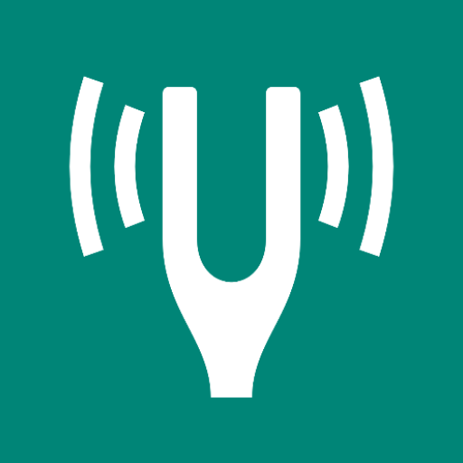
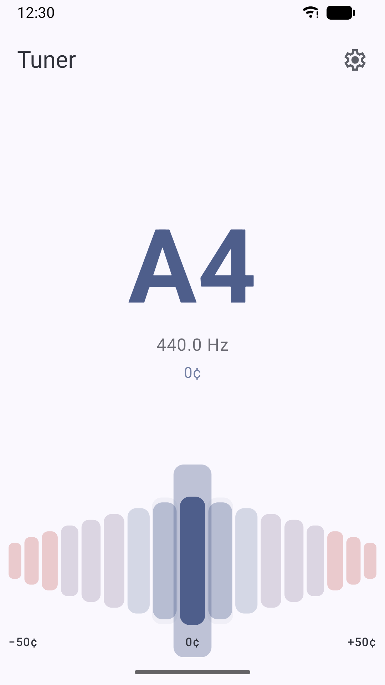
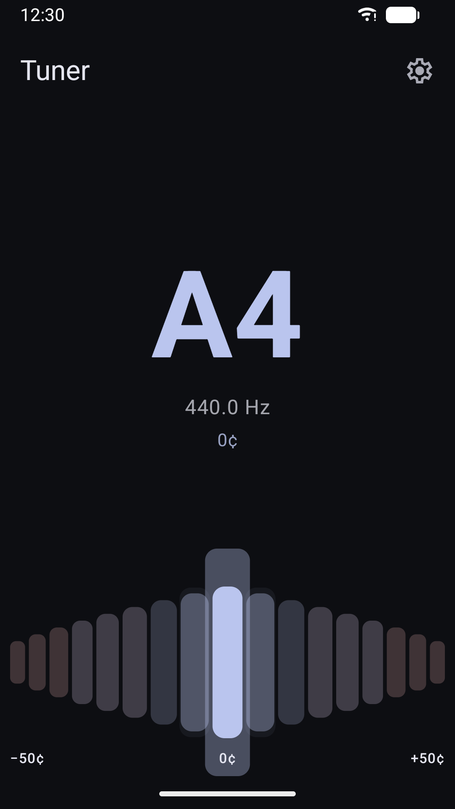

# Tuner

### A simple and precise tuner for Android

Tuner listens through your microphone and shows in real time how close each note is,
with a clean interface and no distractions.

## Features

* Chromatic tuner with automatic note detection
* Precise pitch detection down to the cent
* Light and dark theme
* No advertisements
* No trackers
* No unnecessary permissions

## Screenshots

## License

This project is licensed under the GNU GPL v3.
See the [LICENSE](LICENSE) file for the full license text.
